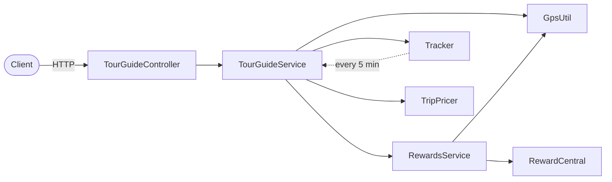

# 🧭 TourGuide

> A Spring Boot REST application that locates users, finds the tourist attractions closest to them, calculates reward points for the attractions they visit, and proposes trip deals. Built on the OpenClassrooms TourGuide project, with an engineering focus on scaling the location-tracking and rewards workloads to **100,000 users** through asynchronous processing.


---

## Contents

- [Architecture](#️-architecture)
- [API endpoints](#-api-endpoints)
- [Tech stack](#️-tech-stack)
- [Getting started](#-getting-started)
- [Performance](#-performance)
- [Tests](#-tests)
- [Continuous integration](#-continuous-integration)

---

## 🏗️ Architecture



Three external libraries provide the domain data: **GpsUtil** (user locations and attractions), **RewardCentral** (reward points) and **TripPricer** (trip deals).

---

## 📡 API endpoints

| Method | Endpoint | Query param | Returns |
|--------|----------|-------------|---------|
| GET | `/` | - | Welcome message |
| GET | `/getLocation` | `userName` | The user's location |
| GET | `/getNearbyAttractions` | `userName` | The 5 closest attractions |
| GET | `/getRewards` | `userName` | The user's reward list |
| GET | `/getTripDeals` | `userName` | Trip deal offers |

Example: `http://localhost:8080/getLocation?userName=internalUser0`

---

## 🛠️ Tech stack

- Java 17
- Spring Boot 3.1.1 (Web, Actuator)
- Maven (wrapper included - no global install needed)
- JUnit 5
- Apache Commons Lang3
- Domain libraries: `gpsUtil`, `rewardCentral`, `tripPricer` (1.0.0)

---

## 🚀 Getting started

### Prerequisites

- JDK 17

### 1. Clone

```bash
git clone https://github.com/Khilone7/TourGuide.git
cd TourGuide
```

### 2. Install the local libraries

The three domain libraries ship as JARs in `libs/` and must be added to your local Maven repository:

```bash
./mvnw install:install-file -Dfile=libs/gpsUtil.jar -DgroupId=gpsUtil -DartifactId=gpsUtil -Dversion=1.0.0 -Dpackaging=jar
./mvnw install:install-file -Dfile=libs/RewardCentral.jar -DgroupId=rewardCentral -DartifactId=rewardCentral -Dversion=1.0.0 -Dpackaging=jar
./mvnw install:install-file -Dfile=libs/TripPricer.jar -DgroupId=tripPricer -DartifactId=tripPricer -Dversion=1.0.0 -Dpackaging=jar
```

> On Windows, use `mvnw.cmd` instead of `./mvnw`.

### 3. Run

```bash
./mvnw spring-boot:run
```

The application starts on `http://localhost:8080`. On startup it generates a set of in-memory test users (see `InternalTestHelper`).

---

## ⚡ Performance

Location tracking and rewards calculation run asynchronously with `CompletableFuture` on dedicated thread pools:

| Workload | Mechanism | Performance target |
|----------|-----------|--------------------|
| Location tracking | `CompletableFuture` + 50-thread pool | 100,000 users in under 15 min |
| Rewards calculation | `CompletableFuture` + 500-thread pool | 100,000 users in under 20 min |

These targets are enforced by the performance test suite.

### Measured results

At 100,000 users, location tracking completes in **~203 s** (target: 900 s) and rewards calculation in **~103 s** (target: 1,200 s).

| Users | Location tracking | Rewards calculation |
|------:|------------------:|--------------------:|
| 100 | < 1 s | 1 s |
| 1,000 | 2 s | 2 s |
| 10,000 | 20 s | 11 s |
| 100,000 | 203 s | 103 s |

> Measured on the development machine; actual figures depend on the available hardware (CPU, RAM).

A background `Tracker` thread also polls every user's location every 5 minutes.

---

## 🧪 Tests

```bash
./mvnw test
```

The suite covers:

- Service unit tests - `TestTourGuideService`, `TestRewardsService`
- Spring context load - `TourGuideApplicationTests`
- Performance tests - `TestPerformance`

> The performance tests run against 100,000 users and can take up to ~20 minutes.

---

## 🔄 Continuous integration

A GitHub Actions workflow runs on every push in three chained stages - **build → test → package** - and uploads the packaged JAR as a build artifact.
